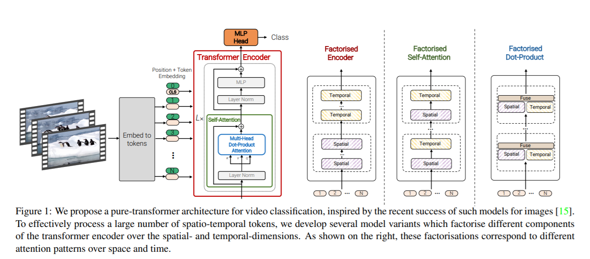

# ViViT: A Video Vision Transformer
Unofficial implementation of [ViViT: A Video Vision Transformer](https://arxiv.org/abs/2103.15691).


## Notes:
* This is the implementation of model 2 only
* Can be initialized by the original Vit pretrained weight from Google:
https://storage.googleapis.com/vit_models/imagenet21k/{model_name}.npz
* Support both "Filter inflation" and "Central frame" initialization for 3Dconv
* No number for Kinetic dataset since i don't have that kind of computational power

## Usage:
```python
git clone https://github.com/NVIDIA/apex
cd apex
pip install -v --disable-pip-version-check --no-cache-dir ./ 
pip install -r requirements.txt
wget https://storage.googleapis.com/vit_models/imagenet21k/ViT-B_16.npz
python train_vivit.py --name test_cifar --pretrained_dir /ViT-B_16.npz --dataset cifar10
```

## Citation:
```
@misc{arnab2021vivit,
      title={ViViT: A Video Vision Transformer}, 
      author={Anurag Arnab and Mostafa Dehghani and Georg Heigold and Chen Sun and Mario Lučić and Cordelia Schmid},
      year={2021},
      eprint={2103.15691},
      archivePrefix={arXiv},
      primaryClass={cs.CV}
}
```

## Acknowledgement:
* Base ViT code and training setting are borrowed from [@jeonsworld](https://github.com/jeonsworld) repo : https://github.com/jeonsworld/ViT-pytorch


